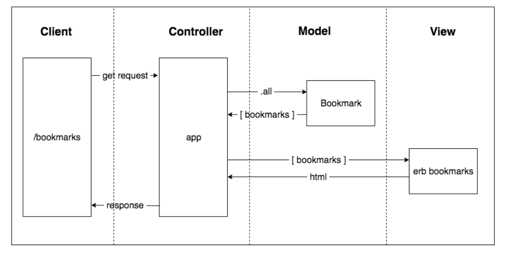

### [Makers Academy](http://www.makersacademy.com) - Week 4 Pair programming challenge 

# Bookmark manager📚

[Task](#Task) | [Installation Instructions](#Installation) | [Database setup](#Database)[Functional Description](#Functional_Description) | [User Stories](#User_Stories) | [Domain Model](#Domain_Model) | [Objects & Methods](#Methods) | [Testing](#Testing) | [Further improvements](#Further_Improvements) |


## <a name="Task">The Task</a>

You're going to build a bookmark manager. A bookmark manager is a website to maintain a collection of bookmarks (URLs). You can use it to save a webpage you found useful. You can add tags to the webpages you saved to find them later. You can browse bookmarks other users have added. You can comment on the bookmarks.

This challenge is the fourth pair programming challenge at [Makers Academy](https://github.com/makersacademy).

## <a name="Installation">Installation Instructions</a>


1. Fork this repository, clone to your local machine then change into the directory:
```
$ git clone git@github.com:davmcgregor/bookmakr-manager.git
$ cd bookmark-challenge
```
2. Load dependencies with bundle:
```
$ gem install bundle
$ bundle
```
3. Run Rspec for tests and coverage, then rubocop for linting
```
$ rspec
$ rubocop
```
4. Run the app on a local server and play on the broswer: http://localhost:4567/

```Shell
$ rackup config.ru -p 4567
```

## <a name="Database">Database setup</a>

1. Connect to psql
2. Create databases using the psql command CREATE DATABASE for `bookmark_manager` and `bookmark_manager_test`;
3. Connect to the databases using the pqsl command \c bookmark_manager;
4. Run the SQL scripts saved in the `db/migrations` folder in the given order;

Note: To set up the testing environment, create a test database and run the psql commands for both databases.

## <a name="Functional_Description">Functional Description</a>

The website will have the following specification:

* Show a list of bookmarks
* Add new bookmarks
* Delete bookmarks
* Update bookmarks
* Comment on bookmarks
* Tag bookmarks into categories
* Filter bookmarks by tag
* Users are restricted to manage only their own bookmarks

## <a name="User_Stories">User Stories</a>

```
As a user,
So I can see all my bookmarks,
I would like to be able to view all saved bookmarks
```
```
As a user
So I can store bookmark data for later retrieval
I want to add a bookmark to Bookmark Manager
```
```
As a user
So I can remove my bookmark from Bookmark Manager
I want to delete a bookmark from
```
```
As a user
So I can make changes to bookmarks in Bookmark Manager
I want to update a bookmark
```

## <a name="Domain_Model">Domain Model</a>



## <a name="Methods">Objects & Methods</a>

## <a name="Testing">Testing</a>

Tests were written with RSpec and Capybara. To run the tests in terminal: 

```bash
$ cd bookmark-manager
$ rspec
```

## <a name="Further_Improvements">Further Improvements</a>
